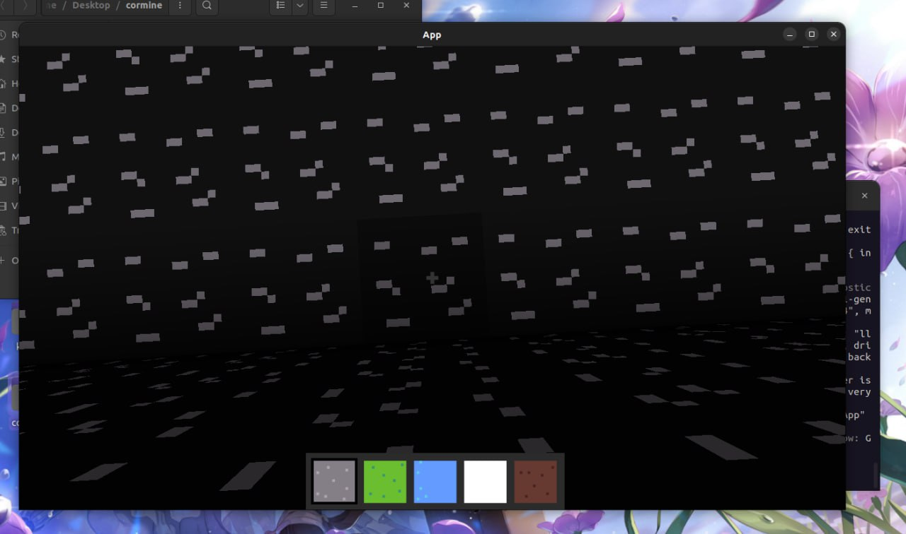
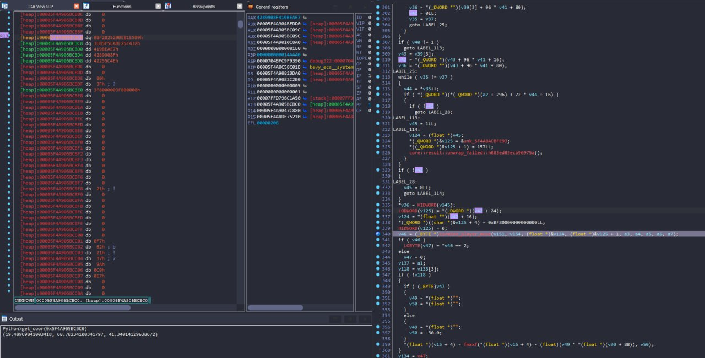
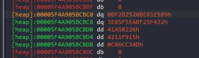
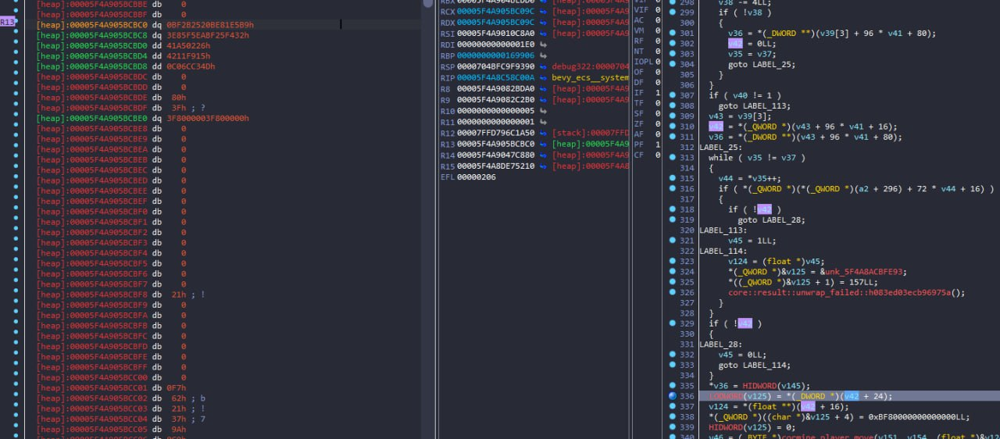
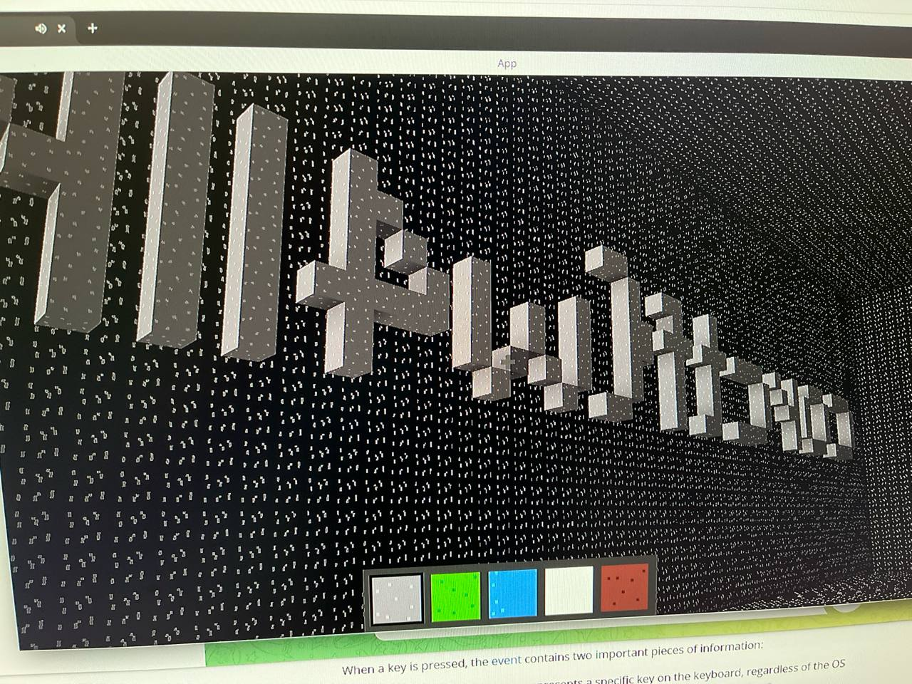

### rev/corMine: The Beginning

This challenge is like the Minecraft game but they coded in Rust.

The target of the challenge is to find a way to get in the box. The box looks like bedrock in Minecraft and is impossible to break. So we need to reverse these entire rust challenges :((

After a day, I found a way that we could get in the box by teleport. To do it, we need to find where's the coordinates.

I follow the code on these functions (handle player move) and then patch it.

Easily change these values (it's float)

So, just load the game, pause at the start (on top of the `box`), change the `y` coordinate to `y-10` and read the flag easily.

