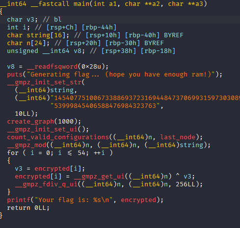
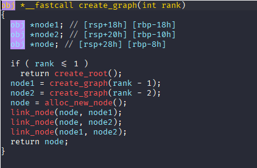
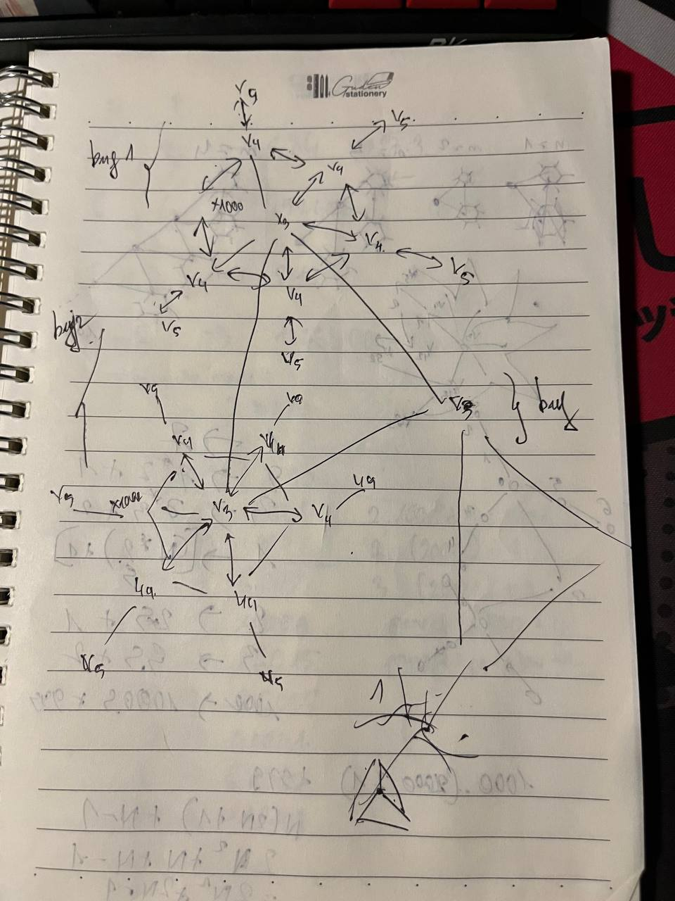
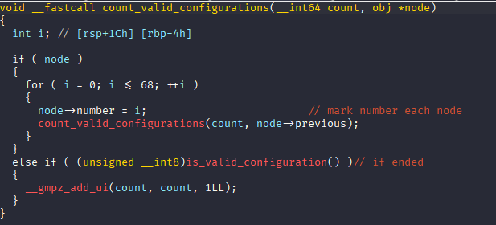
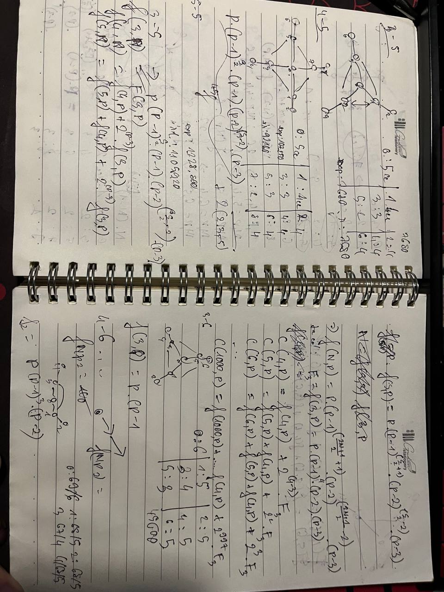
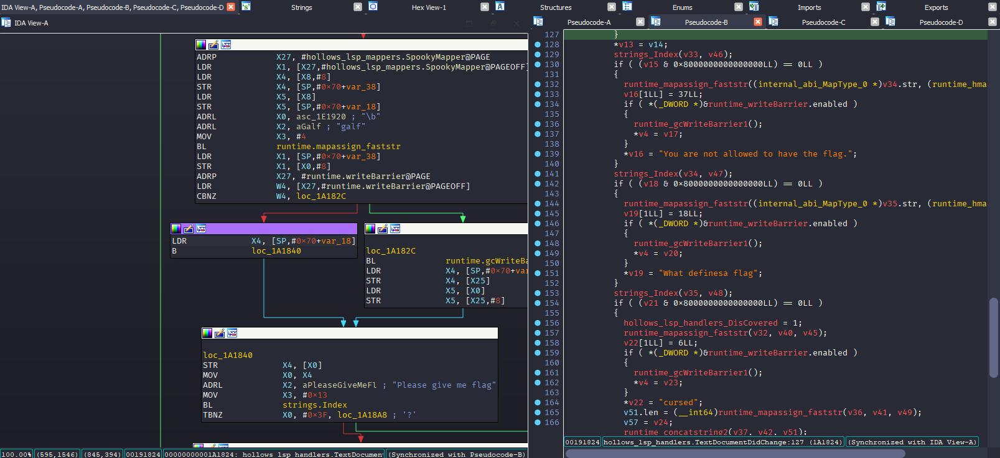

### Gooey

Here's a reverse challenge but it seems we do more on the mathetic.

Here is the main function for which we recovered the structure. We know it calculates the number of nodes



A function that create the graph:




Here's what the graph looks like:



Each main node has 1000 leaf nodes, then it link each other to the next node center node. create a shape like a circle. Each vertex of this node contains 1 more node, then a total of 2001 nodes.

The challenge file is about generating the number of valid configurations for these nodes.

Here's about the check:



So I have a lot of time on research and still not found any solution.



I think that the reverse part is done and the check is correct.

So, I decided to get help from our teammate and that so quickly, he found the solution:
```py
mod = 1454077510067338869372316944847370699315973030897976908309312512336980481738317971337352174999857054574561953999845406588476984323763
N = 1000


import sys 
sys.setrecursionlimit(100000)
#calculate note
leafnode = pow(68, N + 1, mod) * pow(67, N-1, mod) % mod
f= [None for i in range(1001)]

leafnode = 845940199165880131154467934065543040051236143686123185433313869256868344230448440972712550210309176679444331356692040781444769235280


###theory tester
# haha = [[[0 for j in range(68)] for j in range(68) ] for k in range(1000)]

# for i in range(68):
#     haha[0][i][i] = 1


# for i in range(1, 1000):
#     for j in range(68):
#         for k in range(68):
#             for l in range(68):
#                 if l!=k:
#                     haha[i][j][k] += haha[i-1][j][l]
#                     haha[i][j][k] %= mod 

# sum = 0
# for i in range(68):
#     for j in range(68):
#         if i!=j :
#             sum += haha[999][i][j]
#             sum %= mod 
# sum = sum * pow(68, N, mod) % mod 
# print(sum)
# print(leafnode)
####


ans = 0
f[0] = f[1] = leafnode

for i in range(2, 1001):
    f[i] = (f[i-1] * f[i-2] * 68 * 67) % mod 

ans = f[1000] * 69 % mod 

print(ans)
```
```py
def calc_flag(n):
    print('inp:',n)
    f = []
    for j in range(55):
        f.append((n&0xff)^buf[j])
        n//=256
    f = bytes(f)
    print('Flag:',f)
```

Flag: `PCTF{did_you_know?_GUI_stands_for_Graph_User_Interface}`

### Ashwood Hollow-Night

This challenge is as simple that the previous

With a given file in ARM, the file is like an extension that handles some operations when we edit in NeoVim. So I reversed and found some suspicious that one is a check flag.

And here is the solve code:

```py
from Crypto.Cipher import AES
from base64 import b64decode

cipher = b64decode(b'"domyP9d+HL0A/a+MdhXGRekNY1ulvm6vNXOYg0UFMCQVFzZv9kuk9GVdAB+pUanI"')

assert len(cipher)%16==0
key = b'cursedcursedcurs'
aes = AES.new(key,AES.MODE_ECB)
print(aes.decrypt(cipher))
```


Flag: `PCTF{N30v1M_1s_0xfUn_4Nd_L$Ps_R_c001}`