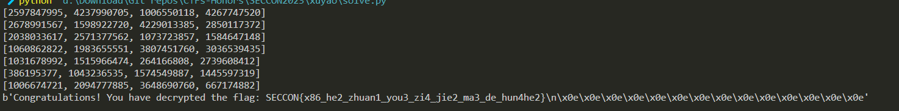
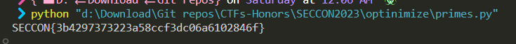

There are 3 challenge that I solved in SECCON 2023

## Sickle

That challenge require me to unpack pickle and get the original code, then reverse the code to get flag.
All my work are in the `Sickle` folder.

```py
import ast
import pickle
from fickling.pickle import Pickled
globals()['f'] = 'a'
payload = b'\x8c\x08builtins\x8c\x07getattr\x93\x942\x8c\x08builtins\x8c\x05input\x93\x8c\x06FLAG> \x85R\x8c\x06encode\x86R)R\x940g0\n\x8c\x08builtins\x8c\x04dict\x93\x8c\x03get\x86R\x8c\x08builtins\x8c\x07globals\x93)R\x8c\x01f\x86R\x8c\x04seek\x86R\x94g0\n\x8c\x08builtins\x8c\x03int\x93\x8c\x07__add__\x86R\x940g0\n\x8c\x08builtins\x8c\x03int\x93\x8c\x07__mul__\x86R\x940g0\n\x8c\x08builtins\x8c\x03int\x93\x8c\x06__eq__\x86R\x940g3\ng5\n\x8c\x08builtins\x8c\x03len\x93g1\n\x85RM@\x00\x86RM\x05\x01\x86R\x85R0g0\ng1\n\x8c\x0b__getitem__\x86R\x940M\x00\x00\x940g2\ng3\ng0\ng6\ng7\n\x85R\x8c\x06__le__\x86RM\x7f\x00\x85RMJ\x01\x86R\x85R0g2\ng3\ng4\ng5\ng3\ng7\nM\x01\x00\x86Rp7\nM@\x00\x86RMU\x00\x86RM"\x01\x86R\x85R0g0\ng0\n]\x94\x8c\x06append\x86R\x940g8\n\x8c\x0b__getitem__\x86R\x940g0\n\x8c\x08builtins\x8c\x03int\x93\x8c\nfrom_bytes\x86R\x940M\x00\x00p7\n0g9\ng11\ng6\n\x8c\x08builtins\x8c\x05slice\x93g4\ng7\nM\x08\x00\x86Rg4\ng3\ng7\nM\x01\x00\x86RM\x08\x00\x86R\x86R\x85R\x8c\x06little\x86R\x85R0g2\ng3\ng4\ng5\ng3\ng7\nM\x01\x00\x86Rp7\nM\x08\x00\x86RMw\x00\x86RM\xc9\x01\x86R\x85R0g0\n]\x94\x8c\x06append\x86R\x940g0\ng12\n\x8c\x0b__getitem__\x86R\x940g0\n\x8c\x08builtins\x8c\x03int\x93\x8c\x07__xor__\x86R\x940I1244422970072434993\n\x940M\x00\x00p7\n0g13\n\x8c\x08builtins\x8c\x03pow\x93g15\ng10\ng7\n\x85Rg16\n\x86RI65537\nI18446744073709551557\n\x87R\x85R0g14\ng7\n\x85Rp16\n0g2\ng3\ng4\ng5\ng3\ng7\nM\x01\x00\x86Rp7\nM\x08\x00\x86RM\x83\x00\x86RM\xa7\x02\x86R\x85R0g0\ng12\n\x8c\x06__eq__\x86R(I8215359690687096682\nI1862662588367509514\nI8350772864914849965\nI11616510986494699232\nI3711648467207374797\nI9722127090168848805\nI16780197523811627561\nI18138828537077112905\nl\x85R.'
with open('lord.py','wb') as f:
    f.write(payload)
idx = payload.index(b'.')+1
loaded = Pickled.load(payload).ast
print(ast.dump(loaded, indent=4))
print(idx)
```

Then I convert this code into python readable.

```py
FLAG = input('FLAG> ').encode()


if len(FLAG)==64:
    #261
    for i in range(8):
        part = int.from_bytes(FLAG[i*8:(i+1)*8],'little')
        part^=1244422970072434993
        res = pow(part,65537,18446744073709551557)

```
Then I wrote this simple script to get flag:

```py

from pwn import p64,xor
# pow(x^1244422970072434993,65537,18446744073709551557)
cs = [
8215359690687096682,
1862662588367509514,
8350772864914849965,
11616510986494699232,
3711648467207374797,
9722127090168848805,
16780197523811627561,
18138828537077112905]
last = 1244422970072434993
flag = b''
for c in cs:
    n = 18446744073709551557
    phi = n-1
    e = 65537
    d = pow(e,-1,phi)
    m = pow(c,d,n)
    flag += p64(m^last)
    last = c
print(flag)
```

# xuyao

A Chinese challenge, in medium.

First we need to reverse the binary to indentify which encryption was used.

Here's my represent of binary code in python. It's look simple but trust me, It take a while to understand the binary and represent the code.

```py
def enc_part(n):
    tmp = u32(bytes([sbox[i] for i in p32(n)]))
    return tmp^rol(tmp,3)^rol(tmp,14)^rol(tmp,15)^rol(tmp,9)
def encrypt_block(inp_block):
    assert len(inp_block)==16
    inp = list(struct.unpack('>IIII',inp_block))
    for i in range(32):
        v10 = inp[3]^inp[2]^inp[1]^u32(buh[i*4:(i+1)*4])
        print(v10)
        part0 = inp[0]^enc_part(v10)
        inp.append(part0)
        inp.pop(0)
    
    print(inp)
    return struct.pack('>IIII',*inp[::-1])
```

Then, we need to reverse this operation and get flag:

```py
from z3 import *
from pwn import p32,u32
import struct
rol = lambda val, r_bits: \
    (val << r_bits%32) & (2**32-1) | \
    ((val & (2**32-1)) >> (32-(r_bits%32)))
ror = lambda val, r_bits: \
    ((val & (2**32-1)) >> r_bits%32) | \
    (val << (32-(r_bits%32)) & (2**32-1))
sbox = list(b'c|w{\xf2ko\xc50\x01g+\xfe\xd7\xabv\xca\x82\xc9}\xfaYG\xf0\xad\xd4\xa2\xaf\x9c\xa4r\xc0\xb7\xfd\x93&6?\xf7\xcc4\xa5\xe5\xf1q\xd81\x15\x04\xc7#\xc3\x18\x96\x05\x9a\x07\x12\x80\xe2\xeb\'\xb2u\t\x83,\x1a\x1bnZ\xa0R;\xd6\xb3)\xe3/\x84S\xd1\x00\xed \xfc\xb1[j\xcb\xbe9JLX\xcf\xd0\xef\xaa\xfbCM3\x85E\xf9\x02\x7fP<\x9f\xa8Q\xa3@\x8f\x92\x9d8\xf5\xbc\xb6\xda!\x10\xff\xf3\xd2\xcd\x0c\x13\xec_\x97D\x17\xc4\xa7~=d]\x19s`\x81O\xdc"*\x90\x88F\xee\xb8\x14\xde^\x0b\xdb\xe02:\nI\x06$\\\xc2\xd3\xacb\x91\x95\xe4y\xe7\xc87m\x8d\xd5N\xa9lV\xf4\xeaez\xae\x08\xbax%.\x1c\xa6\xb4\xc6\xe8\xddt\x1fK\xbd\x8b\x8ap>\xb5fH\x03\xf6\x0ea5W\xb9\x86\xc1\x1d\x9e\xe1\xf8\x98\x11i\xd9\x8e\x94\x9b\x1e\x87\xe9\xceU(\xdf\x8c\xa1\x89\r\xbf\xe6BhA\x99-\x0f\xb0T\xbb\x16')
inv_sbox = [sbox.index(i) for i in range(256)]
buh = b'\x14x\x06\xf6~\xcbs\xed\xb2\xa8\x83\x15\x93\x8d\xde\rK7\xe2#r<\xb8@\x1a\x81?\x0b\x93\xa9\xe7\xd6|\xde"&\xae\xdc\x81\xc5LR\x06\xa9\xc1,O\xdbw4\xdb\r\xa4\x92\x1a\x8c\xc0\x11\xd7;\x03e\xb1\x1b \xd7\xac\x00\xd0\xf25\'\xfe\x00\x93\x9a\xa7V%\xfbX\xfe\xe1\xcb\xc9\xb8=\xc0\x01\xb7|\xf7\xae\x85\x1f\n\xdc\'\xdd\x14\xa9\xe3\xa5\xe1\xee\xf9\xd1A\xe7\xfcj\xfe2\xac\x0e\xd8\xad\xfe>\xf4\x0f\xd8ud\xd6\x10\xa38'
enc = b"\xfe`\xa8\xc0;\xfe\xbcf\xfc\x9a\x9b1\x9a\xd8\x03\xbb\xa9\xe1V\xfc\xfc\x11\x9f\x89_M\x9f\xe0\x9f\xae*\xcf^s\xcb\xec?\xff\xb9\xd1\x99D\x1b\x9ayy\xec\xd1\xb4\xfd\xea+\xe2\xf1\x1apv<.\x7f?;{f\xa3K\x1b\\\x0f\xbe\xdd\x98Z[\xd0\n=~,\x10V*\x10\x87]\xd9\xb9\x7f>.\x86\xb7\x17\x04\xdf\xb1'\xc4G\xe2\xd9z\x9aH|\xdb\xc6\x1d<\x00\xa3!"

def dec_part(n):
    x = BitVec('x',32)
    s = Solver()
    s.add(x^RotateLeft(x,3)^RotateLeft(x,14)^RotateLeft(x,15)^RotateLeft(x,9) == BitVecVal(n,32))
    s.check()
    tmp = s.model()[x].as_long()
    return u32(bytes([inv_sbox[i] for i in p32(tmp)]))
def enc_part(n):
    tmp = u32(bytes([sbox[i] for i in p32(n)]))
    return tmp^rol(tmp,3)^rol(tmp,14)^rol(tmp,15)^rol(tmp,9)

def decrypt_block(inp_block):
    assert len(inp_block)==16
    inp = list(struct.unpack('>IIII',inp_block))[::-1]
    print(inp)
    for i in range(31,-1,-1):
        part0 = inp.pop()
        enc_p = enc_part(inp[0]^inp[1]^inp[2]^u32(buh[i*4:(i+1)*4]))
        inp = [part0^enc_p] + inp
        # print(inp)
    return struct.pack('>IIII',*inp)
message = b''
for i in range(len(enc)//16):
    b = enc[i*16:(i+1)*16]
    message += decrypt_block(b)
    # print(message)
print(message)
```


# optinimize

This challenge has a bit cryptanalysis.

The binary try to print flag but it very slow, then we must speed up the process.

Here's my script try to rewrite the process with the optimize algorithm and get flag in 2m44sA:

``primes.py``

```py
from gmpy2 import next_prime
cs = [60, 244, 26, 208, 138, 23, 124, 76, 223, 33, 223, 176, 18, 184, 78,
250, 217, 45, 102, 250, 212, 149, 240, 102, 109, 206, 105, 0, 125, 149,
234, 217, 10, 235, 39, 99, 117, 17, 55, 212]
ns = [74, 85, 111, 121, 128, 149, 174, 191, 199, 213, 774, 6856, 9402, 15616,
17153, 22054, 27353, 28931, 36891, 40451, 1990582, 2553700, 3194270,
4224632, 5969723, 7332785, 7925541, 8752735, 10012217, 11365110, 17301654,
26085581, 29057287, 32837617, 39609127, 44659126, 47613075, 56815808,
58232493, 63613165]
seq = [0,1]
pseudoprimes = [	271441, 904631, 16532714, 24658561, 27422714, 27664033, 46672291, 102690901, 130944133, 196075949, 214038533, 517697641, 545670533, 801123451, 855073301, 903136901, 970355431, 1091327579, 1133818561, 1235188597, 1389675541, 1502682721, 2059739221, 2304156469, 2976407809, 3273820903]
i = 0
while i<63613165:
    p = next_prime(seq[-1])
    while pseudoprimes and pseudoprimes[0]<p:
        seq.append(pseudoprimes.pop(0))
    seq.append(p)
    i+=1
    # print(len(seq))
for i in range(len(cs)):
    res = seq[ns[i]]%256
    print(chr(cs[i]^(res)),end= "")
```



Detailed in `optinimize` folder.